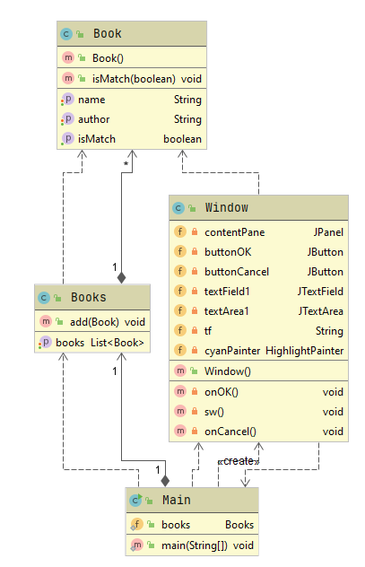
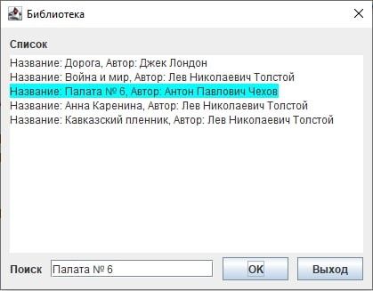
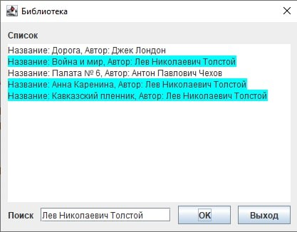
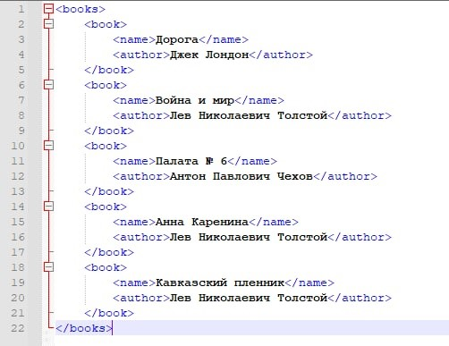

# Library
## Постановка задачи
Распарсить xml файл, в котором содержаться элементы(книги) имеющие название и 
автора и сделать по нему поиск(поиск осуществляется по автору или по названию). 
Результат поиска подсвечивается в списке.

## Описание архитектуры приложения
UML диаграмма классов: 

## Результаты работы приложения
Поиск автора книги по ее названию: 

Поиск книг по имени автора: 

xml: 

## Использованные технологии
- GUI: Swing

## Вывод
В результате работы было написано приложение — «Библиотека» для поиска книг. 
